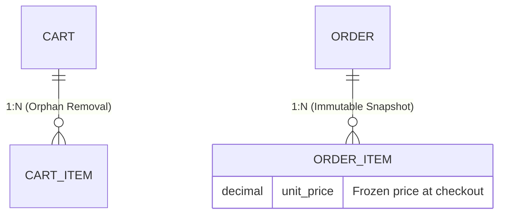

# Titan Commerce API


> RESTful API built to support critical e-commerce operations, focused on stock concurrency resolution, financial consistency, and data security.

---

## About

This project goes beyond a simple product CRUD. It was designed to solve real challenges in the digital retail domain. The architecture focuses on guaranteeing ACID properties, preventing financial anomalies, and automating business processes through system self-healing.

Developed as a practical project during the **Systems for Internet program at IF Sertão PE (Campus Salgueiro)**.

---

## Getting Started

### Prerequisites

- [Docker](https://www.docker.com/get-started) and Docker Compose installed

### Running the project

**1. Clone the repository**
```bash
git clone https://github.com/juliogitdev/Titan-Commerce
cd commerce
```

**2. Set up environment variables**
```bash
cp .env.example .env
```
Edit the `.env` file with your credentials:
```env
DB_USER=your_user
DB_PASSWORD=your_password
DB_NAME=titan
JWT_SECRET=your_jwt_secret
```

**3. Start the application**
```bash
docker-compose up
```

The API will be available at `http://localhost:8080`.
Swagger UI will be available at `http://localhost:8080/swagger-ui.html`.

---

## Tech Stack

| Layer | Technology |
|---|---|
| Language | Java 21 |
| Framework | Spring Boot 3.4 |
| Security | Spring Security + Auth0 JWT |
| Persistence | Spring Data JPA (Hibernate) |
| Database | PostgreSQL 16 |
| Migrations | Flyway |
| Containerization | Docker + Docker Compose |
| Utilities | Lombok, Springdoc OpenAPI |

---

## Engineering Decisions

### 1. Race Condition Prevention (Pessimistic Locking)

In high-concurrency scenarios such as Black Friday, multiple simultaneous requests may attempt to purchase the last unit of a SKU, potentially generating negative stock.

**Solution:** Implementation of `Pessimistic Lock` (`SELECT FOR UPDATE`) at the repository level. The database applies an exclusive row-level lock on the product variant during the checkout transaction, ensuring that concurrent requests wait and are rejected (HTTP 400) when stock reaches zero, preserving logistical integrity.

---

### 2. System Self-Healing (Async Workers)

Orders stuck in `PENDING_PAYMENT` retain stock reservation, generating false negatives and lost sales.

**Solution:** The `OrderCleanupService` is an autonomous worker scheduled with `@Scheduled`. It asynchronously scans the database for expired orders and executes a dual transactional rollback: cancels the payment intent and returns the exact unit back to the SKU physical stock.

---

### 3. Data Modeling: Volatility vs. Historical Immutability

Strict separation between purchase intent and financial contract.

- **Cart (Volatile):** Configured with JPA `Orphan Removal` for physical deletion of removed items, preventing transactional garbage accumulation and database performance degradation.
- **Order (Immutable):** A financial snapshot (`unit_price`) is generated at checkout time. If the catalog changes tomorrow, the user purchase history remains unaltered.



---

## Project Structure

```
src/
└── main/
    ├── java/com/titan/commerce/
    │   ├── modules/
    │   │   ├── user/
    │   │   ├── product/
    │   │   ├── cart/
    │   │   ├── order/
    │   │   └── payment/
    │   └── infra/
    │       ├── security/
    │       └── exception/
    └── resources/
        ├── application.properties
        ├── application-dev.properties
        ├── application-prod.properties
        └── db/migration/
```

---

## Authentication

The API uses **JWT (JSON Web Token)** for stateless authentication.

```
POST /auth/login
Content-Type: application/json

{
  "email": "user@email.com",
  "password": "password"
}
```

Include the token in subsequent requests:
```
Authorization: Bearer <token>
```

---

## Environment Variables

| Variable | Description |
|---|---|
| `DB_URL` | PostgreSQL connection URL |
| `DB_USER` | Database username |
| `DB_PASSWORD` | Database password |
| `DB_NAME` | Database name |
| `JWT_SECRET` | Secret key for JWT signing |
| `SPRING_PROFILES_ACTIVE` | Active Spring profile (`dev` or `prod`) |

---

## License

This project is licensed under the MIT License.